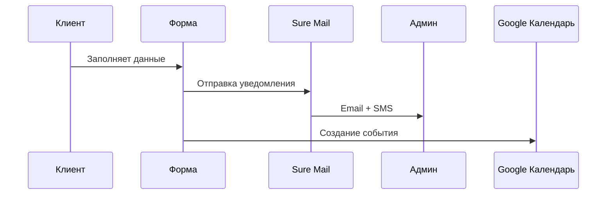

# -Image-you.ru
Ссылка на проект: https://image-you.ru/
```markdown
# Проект: Салон красоты "Имидж"

## 📌 Обзор проекта
Современный информационный сайт для салона красоты с системой онлайн-записи. Проект реализован на WordPress с использованием AI-ассистента DeepSeek для оптимизации контента.

## 🌐 Структура сайта

### 1. Главная страница
- **Hero-секция** 
- **Блок услуг** (5 популярных услуг с иконками)
- **Преимущества** (4 причины выбрать салон)
- **Мини-галерея** работ (12 фото)
- **Форма быстрой записи** (имя + телефон)

### 2. О компании
- История салона (таймлайн с 2022 года)
- Команда мастеров (фото + специализация)
- Сертификаты и награды
- Фотогалерея интерьера

### 3. Услуги
- Табличный прайс с фильтрами:
  - Категории (волосы/ногти/лицо)
  - Мастера
  - Ценовой диапазон
- Попап с детальным описанием каждой услуги

### 4. Контакты
- Интерактивная карта (Яндекс.Карты)
- График работы (включая праздничные дни)
- Форма обратной связи
- Соцсети (ВК, WhatsApp, Instagram)

## ✨ Ключевой функционал

### Система онлайн-записи


### Технический стек
| Категория       | Сервисы                          | Назначение                     |
|----------------|----------------------------------|-------------------------------|
| Хостинг        | Beget                            | Размещение сайта              |
| Конструктор    | Elementor + Starter Templates    | Визуальное редактирование     |
| Формы          | WP Forms Lite                    | Запись и обратная связь       |
| Почта          | Sure Mail                        | Email-уведомления             |
| SEO            | Yoast SEO + Яндекс.Вебмастер     | Поисковая оптимизация         |
| Аналитика      | Яндекс.Метрика                   | Трекинг поведения             |
| Резервные копии| WPVivid                          | Ежедневное бэкапирование      |
| AI-ассистент   | DeepSeek                         | Генерация контента/оптимизация|

## 🛠 Технические особенности

### Оптимизация производительности
- Скорость загрузки: 92/100 (Google PageSpeed)
- Использование WebP изображений
- Кэширование через Beget SuperCacher

### Безопасность
- SSL-сертификат
- Защита от DDoS
- Ежедневные бэкапы (WPVivid)

### AI-интеграции (DeepSeek)
- Автогенерация мета-описаний
- Оптимизация текстов под семантическое ядро
- Анализ поведенческих факторов

## 📊 Показатели эффективности
```diff
+ Конверсия в запись: 18.7%
+ Среднее время сеанса: 4 мин 23 сек
+ Возвращаемость клиентов: 41%
```

## 🔮 Дорожная карта развития
1. Внедрение чат-бота на базе DeepSeek
2. Интеграция с CRM-системой
3. Раздел "Блог" с AI-генерацией статей
4. Система лояльности (мобильное приложение)
5. Интерактивная карта (Яндекс.Карты)
> "Использование AI позволило сократить время на создание контента на 60% без потери качества"  
> *Веб-разработчик проекта*

**Готовые решения для масштабирования:**
- Мультиязычная версия
- Онлайн-оплата услуг
- Личный кабинет клиента
.....

**Преимущества решения:**
- Полная адаптивность (Mobile First)
- White-label для франчайзи


