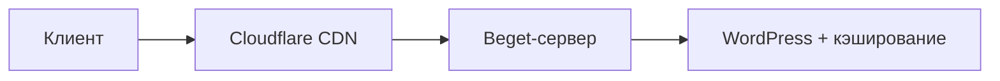

# -Image-you.ru
Ссылка на проект: https://image-you.ru/
# Проект: «Имидж» — Салон красоты (сайт на WordPress)
## 🌐 **Структура сайта**
1. **Главная страница**  
   - Слайдер с акционными предложениями  
   - Блок "Топ-услуги" (5 карточек с ценами)
   - Отзыв клиента
   - Слово директора
   - Кнопка CTA "Записаться онлайн" 

2. **О компании**  
   - История салона (таймлайн)  
   - Фото команды с описанием квалификации  
   - Сертификаты и награды  

3. **Услуги**  
   - Таблица с ценами (фильтр по категориям: волосы/ногти)  
   - Галерея работ (до/после)  
   - Попап-форма для быстрой записи  

4. **Контакты**  
   - Интерактивная карта (Yandex Maps)  
   - График работы  
   - Форма обратной связи  

## 📝 **Функционал записи на консультацию**
- Многошаговая форма (WP Forms Lite)  
  - Выбор услуги → Мастер → Дата/время → Контактные данные  
- Интеграция с Google Calendar  
- Автоматические email-уведомления (Sure Mail)  

## 🛠 **Используемые технологии**
| Сервис               | Назначение                          |
|----------------------|-------------------------------------|
| **Beget**            | Хостинг и домен                     |
| **Elementor**        | Визуальный редактор страниц         |
| **Starter Templates**| Готовые дизайн-шаблоны              |
| **WP Forms Lite**    | Формы записи и контактов            |
| **WPVivid**          | Резервное копирование               |
| **Yoast SEO**        | SEO-оптимизация                     |
| **Яндекс.Метрика**   | Аналитика поведения пользователей   |
| **Яндекс.Вебмастер** | Мониторинг индексации               |

## 🎨 **Дизайн-решения**
- Цветовая схема: `#f8d7da` (розовый фон) + `#495057` (текст)  
- Шрифты: Playfair Display (заголовки), Roboto (основной текст)  
- Адаптивность: Mobile-first подход  

## ⚙️ **Технические требования**


## 📈 **Метрики эффективности**
- Конверсия в запись: ≥15%  
- Скорость загрузки: <2 сек (GTMetrix)  
- Посещаемость: 1000+ чел/мес  

## 🔄 **Планы развития**
1. Подключение чат-бота для записи  
2. Внедрение системы лояльности  
3. Интеграция с ВК (галерея сторис)  

> *"Сайт создает 80% первичных контактов с новыми клиентами"*  
> **Маркетолог салона**  

**Готовые решения для масштабирования:**  
- Мультилендинги под разные услуги  
- API для CRM-системы  
- Виджет онлайн-оплаты  
``` 

**Оптимизация под задачи:**  
- Для SEO: генератор LSI-текстов в Yoast  
- Для скорости: замена изображений на WebP  
- Для конверсии: A/B-тестирование форм  

